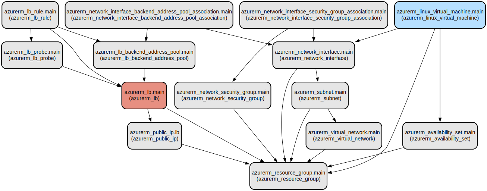

# Azure Load Balanced Infrastructure as Code with Terraform

This project provides an automated infrastructure deployment solution for Azure using Terraform. It creates a highly available web application infrastructure with load balancing capabilities, featuring multiple virtual machines running NGINX behind an Azure Load Balancer.

The infrastructure setup includes a complete network configuration with virtual networks, subnets, and security groups, all managed through Infrastructure as Code (IaC). The solution is designed for production workloads, with built-in high availability through Azure Availability Sets and load balancing capabilities. Each virtual machine is automatically configured with NGINX and displays a custom welcome message, making it ideal for testing load balancer functionality or serving as a foundation for more complex web applications.

## Repository Structure
```
terraform/
├── main.tf           # Core infrastructure definition including VMs, networking, and load balancer
├── outputs.tf        # Defines output values like public IP and resource IDs
├── provider.tf       # Azure provider configuration and version constraints
└── variables.tf      # Input variables for customizing the deployment
```

## Usage Instructions
### Prerequisites
- Terraform (version 1.0.0 or later)
- Azure CLI (latest version)
- Active Azure subscription
- Service Principal with Contributor access

### Installation

1. Install Terraform:
```bash
# MacOS with Homebrew
brew install terraform

# Linux (Ubuntu/Debian)
curl -fsSL https://apt.releases.hashicorp.com/gpg | sudo apt-key add -
sudo apt-add-repository "deb [arch=amd64] https://apt.releases.hashicorp.com $(lsb_release -cs) main"
sudo apt-get update && sudo apt-get install terraform

# Windows with Chocolatey
choco install terraform
```

2. Install Azure CLI:
```bash
# MacOS with Homebrew
brew install azure-cli

# Linux (Ubuntu/Debian)
curl -sL https://aka.ms/InstallAzureCLIDeb | sudo bash

# Windows with PowerShell
Invoke-WebRequest -Uri https://aka.ms/installazurecliwindows -OutFile .\AzureCLI.msi
Start-Process msiexec.exe -Wait -ArgumentList '/I AzureCLI.msi /quiet'
```

### Quick Start

1. Clone the repository and navigate to the terraform directory:
```bash
cd terraform
```

2. Initialize Terraform:
```bash
terraform init
```

3. Create a terraform.tfvars file with your configuration:
```hcl
resource_group_name     = "my-resource-group"
location               = "eastus"
vnet_name              = "my-vnet"
vnet_address_space     = ["10.0.0.0/16"]
subnet_name            = "backend-subnet"
subnet_address_prefixes = ["10.0.1.0/24"]
load_balancer_name     = "my-lb"
vm_count               = 2
admin_username         = "adminuser"
admin_password         = "YourSecurePassword123!"
```

4. Deploy the infrastructure:
```bash
terraform plan
terraform apply
```

### More Detailed Examples

1. Customizing the load balancer configuration:
```hcl
load_balancer_name     = "prod-lb"
lb_sku                 = "Standard"
frontend_port          = 8080
backend_port           = 8080
health_probe_port      = 8080
```

2. Scaling the VM deployment:
```hcl
vm_count = 4
vm_size  = "Standard_D2s_v3"
```

### Troubleshooting

Common issues and solutions:

1. Authentication Failures
```bash
# Verify Azure CLI authentication
az login
az account show
```

2. Resource Provider Registration
```bash
# Register required Azure providers
az provider register --namespace Microsoft.Network
az provider register --namespace Microsoft.Compute
```

3. Load Balancer Health Probe Failures
- Verify NSG rules allow health probe traffic
- Check VM network connectivity
- Inspect NGINX service status:
```bash
ssh adminuser@vm_ip
systemctl status nginx
```

## Data Flow
The infrastructure creates a load-balanced environment where incoming traffic is distributed across multiple VM instances running NGINX.

```ascii
Internet
    │
    ▼
[Public IP]
    │
    ▼
[Load Balancer]
    │
    ├─────────┬─────────┐
    ▼         ▼         ▼
 [VM 1]    [VM 2]    [VM n]
  NGINX     NGINX     NGINX
```

Key component interactions:
1. Traffic arrives at the public IP address
2. Azure Load Balancer distributes requests using round-robin
3. Health probes monitor VM availability on port 80
4. NSG rules control inbound traffic (HTTP/80 and SSH/22)
5. VMs operate in an availability set for high availability
6. Each VM runs NGINX serving a custom welcome page
7. Backend pool automatically manages VM registration

## Infrastructure



Azure Resources:
- **Resource Group**
  - Single resource group containing all deployment resources

- **Networking**
  - Virtual Network with custom address space
  - Subnet for backend servers
  - Network Security Group with HTTP and SSH rules
  - Network interfaces for each VM

- **Load Balancer**
  - Standard SKU Azure Load Balancer
  - Public IP (Static)
  - Backend pool
  - Health probe configuration
  - Load balancing rules

- **Compute**
  - Linux Virtual Machines (Ubuntu 18.04-LTS)
  - Availability Set for high availability
  - Automated NGINX installation and configuration

## Deployment

Prerequisites:
- Azure subscription ID
- Contributor access to the subscription
- Terraform state storage location (local or remote)

Deployment steps:
1. Configure Azure credentials:
```bash
az login
az account set --subscription "<subscription_id>"
```

2. Initialize and validate:
```bash
terraform init
terraform validate
```

3. Deploy infrastructure:
```bash
terraform apply -auto-approve
```

4. Verify deployment:
```bash
curl $(terraform output -raw load_balancer_public_ip)
```